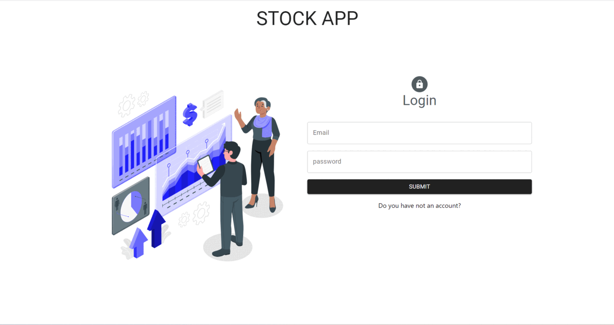
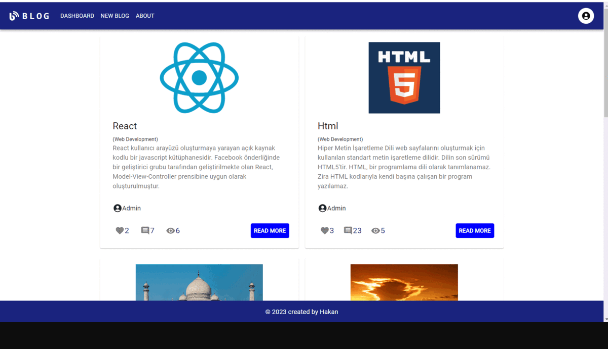
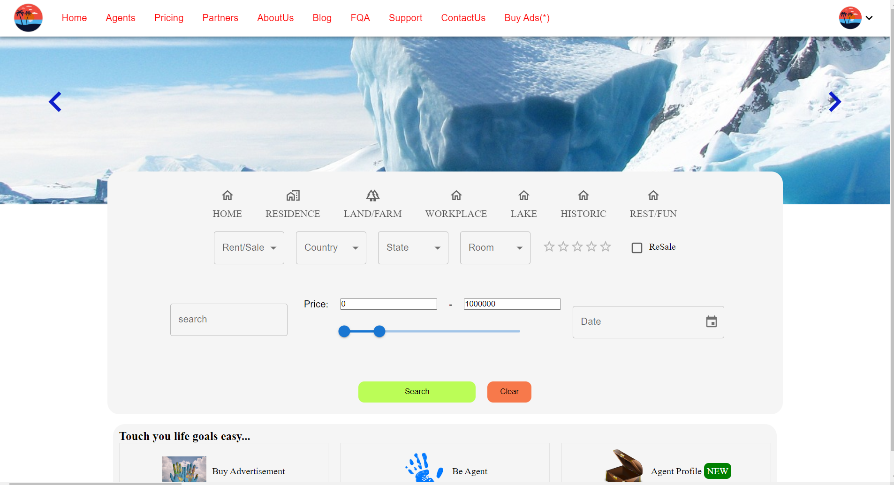
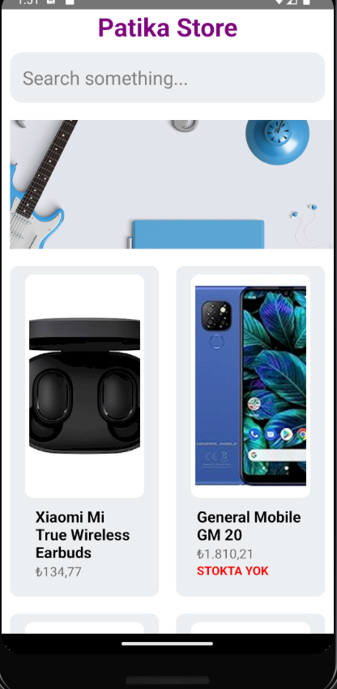
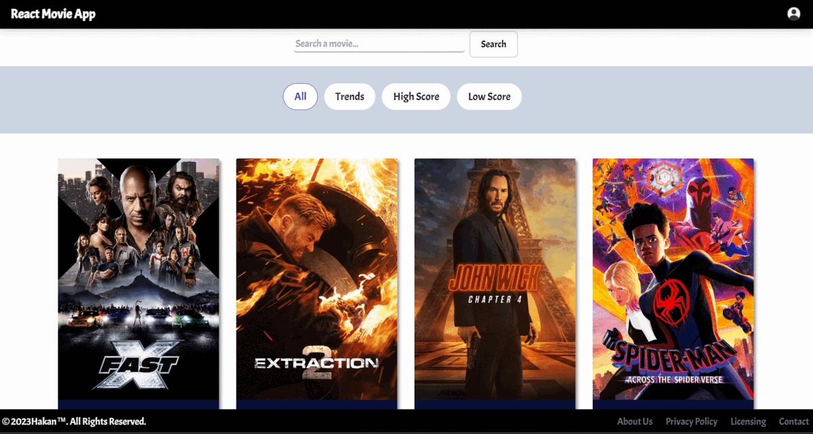
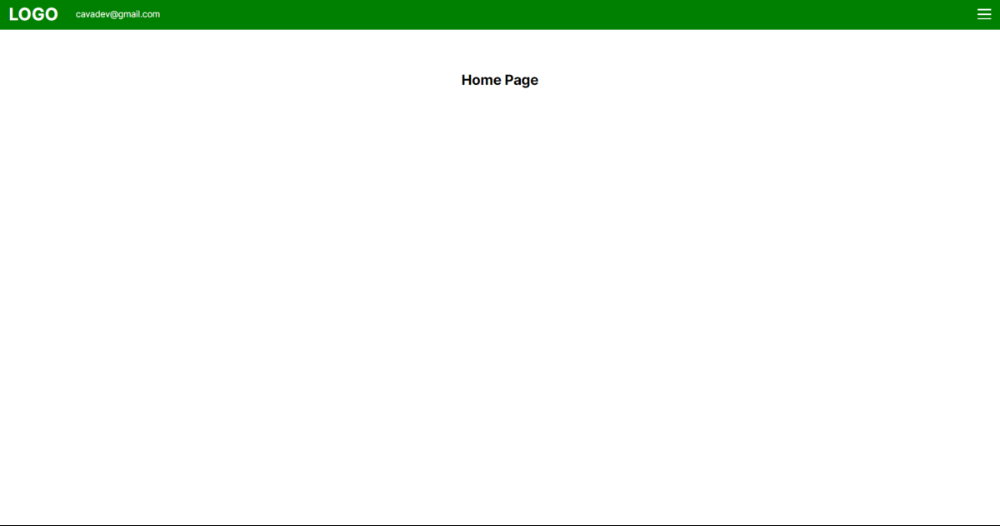

## About Me:
<h2>Hi 👋, I'm <em> Hakan Cava</em></h2>

A passionate mathematician-full stack developer from Turkey.

I am developing full-stack apps using HTML, CSS, JavaScript, React, Redux, Bootstrap, Tailwind, MUI, Django, Python, and more. I am constantly adding new skills to my repertoire to enhance my capabilities.

  

- 🔭 I’m currently working on **E-Commerce App**

- 🌱 I’m currently learning **NextJS/ReactNative/Python-Django**

- 💬 Ask me about **ReactJS**

- 📫 How to reach me **hakancavaa@gmail.com**

## Connect with me:
 

## Languages:

            

<h3 align="left">Tools:</h3>

 

 
  
  

 

  
 
 
 
 
 
 
 
 

 

  
 
  
 

<h2 align="center">My Projects</h2>

###

Project Links       |What I use  |Project Overview   
:-------------------------|---------------------|------------------
[Stock App]() <h3>[Repo](https://github.com/HakanCava/stockApp/tree/main)</h3>| React - MUI - Redux Toolkit - Redux Persist - Custom Hooks - React Router Dom - Formik - Yup - Toastify | 
[Blog App](https://main--myblogpagereact.netlify.app/) <h3>[Repo](https://github.com/HakanCava/blogPageWithReact)</h3>| React - MUI - Redux Toolkit - Redux Persist - Axios - Custom Hooks - React Router Dom - Formik - Yup - Toastify |
[FilterPage App](https://filterhcava.netlify.app/) <h3>[Repo](https://github.com/HakanCava/FilterPage/tree/main)</h3>| React - MUI - Context Api - Custom Components - React Router Dom - DayJs - Toastify | 
[ReactNative Store App]() <h3>[Repo](https://github.com/HakanCava/react-native-storeApp)</h3>| React Native - Custom Components -   | 
[Movie App](https://movie-app-project-theta.vercel.app/) <h3>[Repo](https://github.com/HakanCava/movieAppProject)</h3>| React - Tailwind - Context Api - Custom Hooks - React Router Dom - Axios - Firebase - Toastify | 
[Movie App]() <h3>[Repo](https://github.com/HakanCava/hamburger_menu_nextjs_typescript)</h3>| React- NextJs - TypeScript | 

 <h2 align="center"> 📊 GitHub Stats: </h2>

&nbsp;

